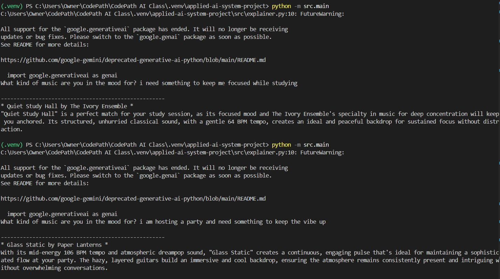
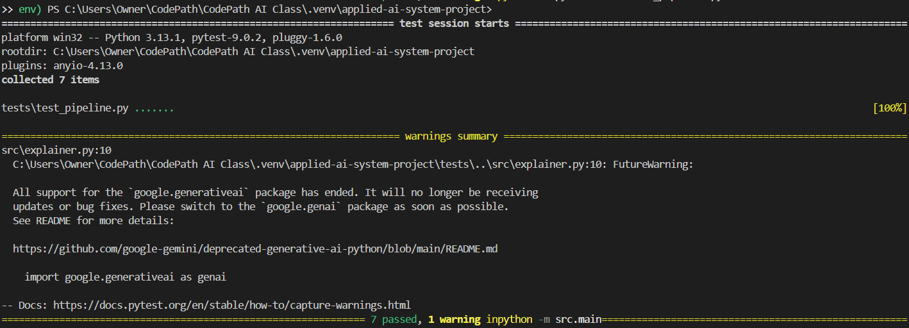

# Title:  Press 'Enter' to Resonate 🎵

## Project Summary
Press 'Enter' to Resonate is a music recommendation app that takes in natural language queries to generate song recommendations, each with an AI-generated explanation for its decision. Users type in a vibe they are looking for such as "something to keep me focused while studying" and, using Retrieval-Augmented Generation (RAG) and Gemini, the system will find a semantically matching song. Previously, users would have to select from a list of moods and energy levels to request songs. This version is designed for users who curate playlists tailored to specific moods, offering flexible, genre-agnostic music discovery without constraints on artists or styles.

## Sample Interactions



**Video Link**
(https://youtu.be/0Q0Q07xG22U)
## Setup Instructions
1. Create a virtual environment (optional but recommended):
   ```bash
   python -m venv .venv
   source .venv/bin/activate      # Mac or Linux
   .venv\Scripts\activate         # Windows

2. Install dependencies

```bash
pip install -r requirements.txt
```

3. Run the app:

```bash
python -m src.main
```

4. testing
```bash
pytest
```
---
## What this project says about me as an AI engineer
As an AI engineer what's important to me is responsibility and intentionality. This is evident in the way I approached creating my song and artist blurb csv files to minimize bias in my model. I observed a diversity bias, reflected on where it likely came from, and thought through what it would mean at scale. As commercial generative AI is a relatively new market with a lot of unknowns, it is the developer's responsibility to consider how their projects will affect the public and not just focus on output and pushing to production. I am intentional about the way I use AI in my development process. In this project I made the decision to use it as a coach instead of a code generator so that I would be able to understand the project on a deeper level. I asked for guidance without answers and took a slower path to understand. As an engineer I focus on building skills not just shipping.