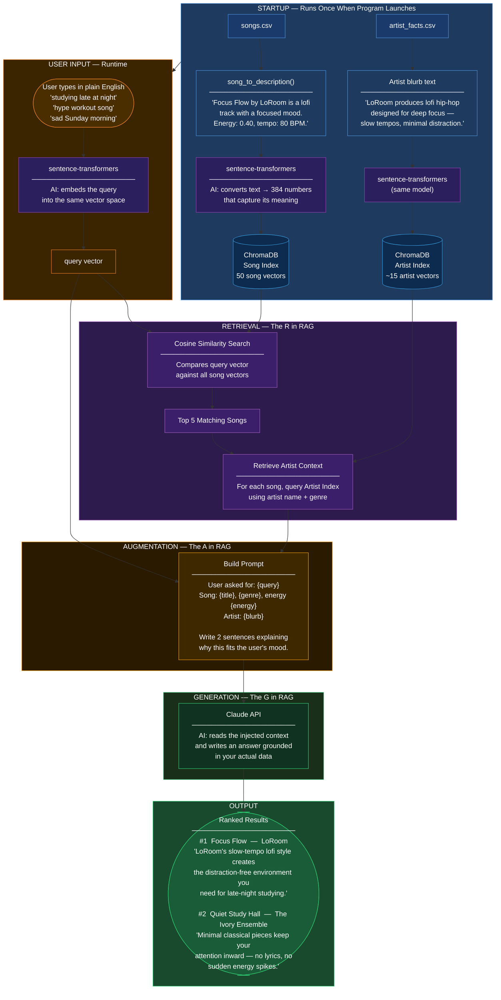

# RAG Flow — Music Recommender

```mermaid
flowchart TD

    subgraph STARTUP["STARTUP — Runs Once When Program Launches"]
        CSV["songs.csv"] --> DESC["song_to_description()\n─────────────────────\n'Focus Flow by LoRoom is a lofi\ntrack with a focused mood.\nEnergy: 0.40, tempo: 80 BPM.'"]
        FACTS["artist_facts.csv"] --> BLURB["Artist blurb text\n─────────────────────\n'LoRoom produces lofi hip-hop\ndesigned for deep focus —\nslow tempos, minimal distraction.'"]
        DESC --> EMB1["sentence-transformers\n─────────────────────\nAI: converts text → 384 numbers\nthat capture its meaning"]
        BLURB --> EMB2["sentence-transformers\n(same model)"]
        EMB1 --> SONGDB[("ChromaDB\nSong Index\n50 song vectors")]
        EMB2 --> ARTISTDB[("ChromaDB\nArtist Index\n~15 artist vectors")]
    end

    subgraph INPUT["USER INPUT — Runtime"]
        Q(["User types in plain English\n'studying late at night'\n'hype workout song'\n'sad Sunday morning'"])
        Q --> QEMB["sentence-transformers\n─────────────────────\nAI: embeds the query\ninto the same vector space"]
        QEMB --> QVEC["query vector"]
    end

    subgraph RETRIEVAL["RETRIEVAL — The R in RAG"]
        QVEC --> SIM["Cosine Similarity Search\n─────────────────────\nCompares query vector\nagainst all song vectors"]
        SONGDB --> SIM
        SIM --> TOPK["Top 5 Matching Songs"]
        TOPK --> CTX["Retrieve Artist Context\n─────────────────────\nFor each song, query Artist Index\nusing artist name + genre"]
        ARTISTDB --> CTX
    end

    subgraph AUGMENTATION["AUGMENTATION — The A in RAG"]
        CTX --> BUILD["Build Prompt\n─────────────────────\nUser asked for: {query}\nSong: {title}, {genre}, energy {energy}\nArtist: {blurb}\n\nWrite 2 sentences explaining\nwhy this fits the user's mood."]
        QVEC --> BUILD
    end

    subgraph GENERATION["GENERATION — The G in RAG"]
        BUILD --> CLAUDE["Claude API\n─────────────────────\nAI: reads the injected context\nand writes an answer grounded\nin your actual data"]
    end

    subgraph OUTPUT["OUTPUT"]
        CLAUDE --> DISPLAY(["Ranked Results\n─────────────────────\n#1  Focus Flow  —  LoRoom\n'LoRoom's slow-tempo lofi style creates\nthe distraction-free environment you\nneed for late-night studying.'\n\n#2  Quiet Study Hall  —  The Ivory Ensemble\n'Minimal classical pieces keep your\nattention inward — no lyrics, no\nsudden energy spikes.'"])
    end

    STARTUP --> INPUT

    style STARTUP fill:#1e3a5f,color:#ffffff,stroke:#4a90d9
    style INPUT fill:#3b2400,color:#ffffff,stroke:#e67e22
    style RETRIEVAL fill:#2d1b4e,color:#ffffff,stroke:#9b59b6
    style AUGMENTATION fill:#2a1a00,color:#ffffff,stroke:#f39c12
    style GENERATION fill:#1a2f1a,color:#ffffff,stroke:#27ae60
    style OUTPUT fill:#1a4a2e,color:#ffffff,stroke:#2ecc71

    style CSV fill:#1a3a6b,color:#ffffff,stroke:#4a90d9
    style FACTS fill:#1a3a6b,color:#ffffff,stroke:#4a90d9
    style DESC fill:#1e3a5f,color:#ffffff,stroke:#4a90d9
    style BLURB fill:#1e3a5f,color:#ffffff,stroke:#4a90d9
    style EMB1 fill:#2c1f5e,color:#ffffff,stroke:#8e44ad
    style EMB2 fill:#2c1f5e,color:#ffffff,stroke:#8e44ad
    style SONGDB fill:#0d2b4e,color:#ffffff,stroke:#3498db
    style ARTISTDB fill:#0d2b4e,color:#ffffff,stroke:#3498db

    style Q fill:#4a2e00,color:#ffffff,stroke:#e67e22
    style QEMB fill:#2c1f5e,color:#ffffff,stroke:#8e44ad
    style QVEC fill:#3b2400,color:#ffffff,stroke:#e67e22

    style SIM fill:#3b1f6b,color:#ffffff,stroke:#9b59b6
    style TOPK fill:#3b1f6b,color:#ffffff,stroke:#9b59b6
    style CTX fill:#3b1f6b,color:#ffffff,stroke:#9b59b6

    style BUILD fill:#3d2800,color:#ffffff,stroke:#f39c12

    style CLAUDE fill:#0f3320,color:#ffffff,stroke:#2ecc71

    style DISPLAY fill:#1a5c38,color:#ffffff,stroke:#2ecc71
```
